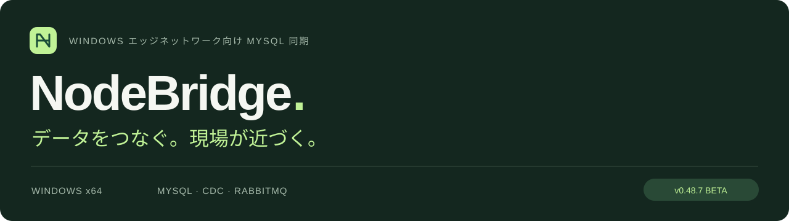
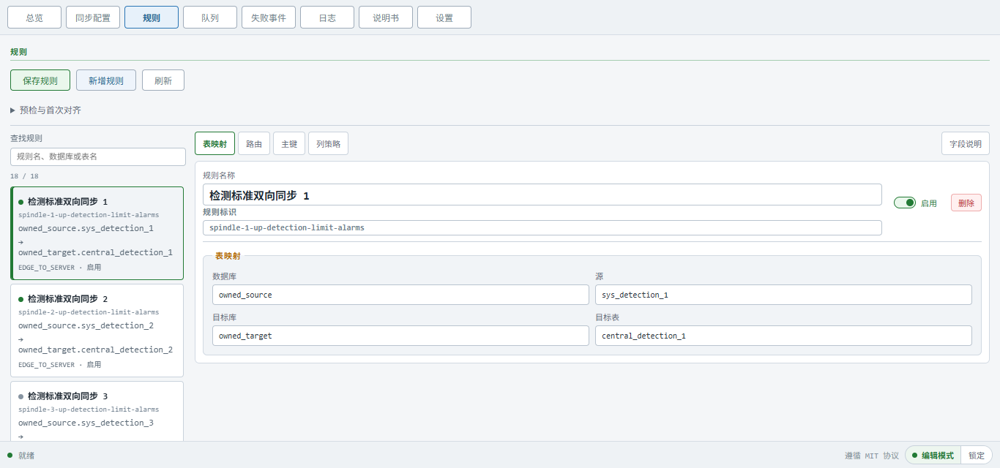

<p align="center">
  <a href="README.md">English</a> · <a href="README.zh-CN.md">简体中文</a> · <a href="README.ja.md">日本語</a>
</p>



<p align="center">
  <strong>中央サーバーとエッジを接続。MySQL 同期、ローカル管理、自動再接続 をひとつの運用へ。</strong>
</p>

<p align="center">
  <a href="https://github.com/YufeiSun5/NodeBridge/releases/download/v0.48.7/NodeBridge-beta-v0.48.7-20260915.exe"><strong>⬇ Windows インストーラー</strong></a>
  &nbsp; · &nbsp; <a href="https://github.com/YufeiSun5/NodeBridge/releases/tag/v0.48.7">リリースノート</a>
  &nbsp; · &nbsp; <a href="docs/lan-deployment-guide.md">導入ガイド</a>
</p>

---

## MCP · AI アシスタントを同期運用につなぐ

**ローカル stdio または SSH で、ご自身の MCP クライアントを NodeBridge に接続。** 会話から実行記録の確認、設定管理、整合タスクの追跡を行えます。

| 依頼の例 | NodeBridge の機能 |
| --- | --- |
| 「このノードの同期が止まった理由は？」 | Agent、キュー、ログ、イベント記録を確認し、診断を出力。 |
| 「保存前にマッピングを確認して」 | スキーマとルールを取得し、ローカル事前検証とリビジョン確認を経て保存。 |
| 「承認済みの初期整合を追跡して」 | 確認済みタスクを開始し、全参加ノードの完了を確認してから同期を再開。 |

Agent の起動・停止、失敗イベントの再試行、構造化された業務データの照会・変更にも対応します。データ変更には計画と明示的な確認が必要です。任意のシェルや生の SQL は公開しません。

**接続方法：**完全な設定を保存し、NodeBridge で MCP を有効化します。設定を所有する Windows アカウントでクライアントを実行し、ノードごとに接続を登録します。SSH は stdio を転送するため、MCP HTTP ポートは不要です。

```powershell
& 'C:\Program Files\NodeBridge\app\SyncAgent.exe' mcp-stdio -config 'C:\ProgramData\NodeBridge\config.yaml'
```

初期整合には全参加ノードの Agent 停止と確認が必要です。ポーリング中は各 MCP セッションを維持してください。`running` は完了ではありません。事前検証はローカルのみで、変更後は保存済み・有効リビジョンを確認します。

[MCP ツールと接続設定](docs/mcp-service.md) · [複数ノードの AI 操作ガイド](docs/mcp-business-ai-handoff.md) · [MCP のインタラクティブ紹介](https://yufeisun5.github.io/NodeBridge/#mcp)

## つながる現場を支える機能

<table>
<tr>
<td width="50%"><h3>↻ &nbsp; 自動で再接続</h3><p>失効した RabbitMQ 接続を再構築し、接続復旧後に同期を再開。</p></td>
<td width="50%"><h3>↔ &nbsp; データの宛先を明確に</h3><p>DB・テーブル・列の対応を設定。双方向同期にも対応。</p></td>
</tr>
<tr>
<td width="50%"><h3>≡ &nbsp; 読みやすいルール</h3><p>わかりやすい表示名と、安定した ID・既存の整合記録を両立。</p></td>
<td width="50%"><h3>↑ &nbsp; システム DB も更新</h3><p>インストール時に設定済みシステム DB を更新。移行失敗時は完了を停止。</p></td>
</tr>
<tr>
<td width="50%"><h3>✓ &nbsp; コミット後に ACK</h3><p>トランザクション、イベントの冪等性、明確な ACK 境界を維持。</p></td>
<td width="50%"><h3>⌘ &nbsp; 自分の環境で管理</h3><p>ローカル Wails UI または SSH stdio MCP から設定・診断。</p></td>
</tr>
</table>

## ルールも詳細も、見やすい画面で



<sub>NodeBridge の実際のフロントエンド。隔離テストデータを使用し、目立つ表示名、検索、コンパクトな編集を示しています。</sub>

## はじめる

1. **環境を準備。** MySQL を別途用意し、固有のノード ID を設定。設定・ルール・DB をバックアップします。
2. **インストール。** 使用する Windows アカウントで x64 インストーラーを管理者として実行。NodeBridge、SyncAgent、Erlang/OTP、RabbitMQ、Java、Canal、WinSW を同梱します。
3. **設定と検証。** マッピングと初期整合を確認し、ご自身の環境で追加・更新・削除・接続復旧を検証します。

> 更新時：業務テーブルへの列追加は不要です。表示名を変えてもルール ID と整合記録を維持してください。設定済みシステム DB の移行失敗時は完了を停止します。

アプリ：`C:\Program Files\NodeBridge\app` · データ：`C:\ProgramData\NodeBridge`。画面を閉じてもトレイに常駐し、終了には設定済みパスワードが必要です。

## リリースと検証

**v0.48.7 Beta** は再接続、部分コミット済みバッチの転送漏れ、双方向の宛先 DB 選択を修正。Go test/vet/lint、インストーラー検証、隔離 3 Agent の再接続 2 回を検証済みです。物理 PC 3 台の性能や本番 SLA を保証しません。インストーラーは未署名です。

[検証記録を読む（中国語）](docs/v0.48.7-reconnect-handoff-20260915.md) · [SHA256](https://github.com/YufeiSun5/NodeBridge/releases/download/v0.48.7/SHA256SUMS.txt)

## プロジェクトを詳しく

- [LAN 導入](docs/lan-deployment-guide.md)
- [初期整合](docs/initial-alignment.md)
- [ルーティング](docs/sync-routing-policy.md)
- [管理コンポーネント](docs/managed-components.md)
- [試用手順](docs/trial-runbook.md)
- [MCP リファレンス](docs/mcp-service.md)

<details>
<summary><strong>ビルドと検証</strong></summary>

```powershell
go test ./...
go vet ./...
golangci-lint run ./...
cd frontend
npm ci
npm test
npm run build
```

</details>

---

[MIT ライセンス](LICENSE) で公開。既定の README は英語です。上部のリンクで言語を選択できます。
