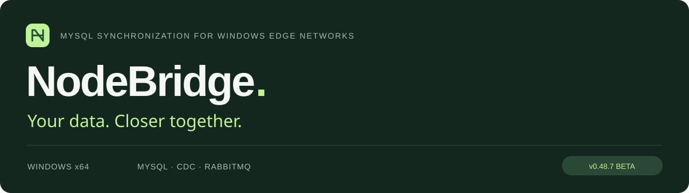
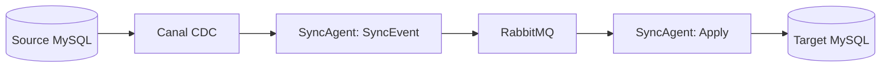

<p align="center">
  <a href="README.md">English</a> · <a href="README.zh-CN.md">简体中文</a> · <a href="README.ja.md">日本語</a>
</p>



<p align="center">
  <strong>MySQL synchronization built on Canal and RabbitMQ, with column mapping, bidirectional sync and MCP tools for AI-assisted monitoring and operations.</strong>
</p>

<p align="center">
  <a href="https://github.com/YufeiSun5/NodeBridge/releases/download/v0.48.7/NodeBridge-beta-v0.48.7-20260915.exe"><strong>⬇ Download Windows installer</strong></a>
  &nbsp; · &nbsp; <a href="https://github.com/YufeiSun5/NodeBridge/releases/tag/v0.48.7">Release notes</a>
  &nbsp; · &nbsp; <a href="docs/lan-deployment-guide.md">Deployment guide</a>
</p>

---

## Architecture



One direction is shown. Bidirectional rules also process the reverse flow, with routing and replay detection. MCP is a management interface, not a required hop in the data path.

**Quick start:** install the [Windows release](https://github.com/YufeiSun5/NodeBridge/releases/latest), prepare MySQL/binlog using the [deployment guide](docs/lan-deployment-guide.md), then configure connections and a table rule. Verify insert, update and delete operations with separate test data first.

A ready-to-run Docker demo is not yet released. See the [future plan](docs/distribution-and-validation-plan.md).

## MCP · Bring your AI assistant into sync operations

**Connect your MCP client to NodeBridge through local stdio or remote SSH.** Inspect evidence, manage configuration and follow alignment tasks from one conversation.

| Ask your assistant | NodeBridge capabilities |
| --- | --- |
| “Why has this node stopped syncing?” | Inspect Agent status, queues, logs and event receipts; export diagnostics. |
| “Check this mapping before saving.” | Read schema and rules, preflight local mappings, validate and save configuration with revision checks. |
| “Track our approved initial alignment.” | Start the confirmed task, poll progress and inspect the complete group before restarting synchronization. |

MCP also supports Agent control, failed-event retries and structured business-data queries and changes. Data changes require a plan and explicit confirmation; arbitrary shell and raw SQL are not exposed.

**Connect:** save a complete configuration, enable MCP in NodeBridge, then run your client as the Windows account that owns that configuration. Each node gets its own client entry; SSH carries stdio without opening an MCP HTTP port.

```powershell
& 'C:\Program Files\NodeBridge\app\SyncAgent.exe' mcp-stdio -config 'C:\ProgramData\NodeBridge\config.yaml'
```

Initial alignment requires stopped Agents on all participants, confirmation and open MCP sessions while polling. A task returning `running` is not complete. Rule preflight checks the local node; verify the saved and active revisions after changes.

[MCP tools and client configuration](docs/mcp-service.md) · [Multi-node AI handoff guide](docs/mcp-business-ai-handoff.md) · [Interactive MCP overview](https://yufeisun5.github.io/NodeBridge/#mcp)

## Built for connected operations

<table>
<tr>
<td width="50%"><h3>↻ &nbsp; Reconnect automatically</h3><p>Rebuild failed RabbitMQ connections and resume synchronization when connectivity returns.</p></td>
<td width="50%"><h3>↔ &nbsp; Map your data explicitly</h3><p>Configure database, table and column mappings, including bidirectional synchronization.</p></td>
</tr>
<tr>
<td width="50%"><h3>≡ &nbsp; Keep rules readable</h3><p>Use clear display names while preserving stable IDs and existing alignment records.</p></td>
<td width="50%"><h3>↑ &nbsp; Upgrade the system database</h3><p>Update configured NodeBridge system databases during installation, with failure checks.</p></td>
</tr>
<tr>
<td width="50%"><h3>✓ &nbsp; Commit before ACK</h3><p>Keep transactional writes, event idempotency and message acknowledgment boundaries explicit.</p></td>
<td width="50%"><h3>⌘ &nbsp; Manage from your environment</h3><p>Use the local Wails UI or SSH stdio MCP for configuration and diagnostics.</p></td>
</tr>
</table>

## A workspace that keeps the details in view


<sub>Actual NodeBridge frontend, shown with isolated test data. Prominent rule names, searchable navigation and compact editing.</sub>

## Get started

1. **Prepare.** Install MySQL separately. Give every node a unique ID and back up configuration, rules and databases.
2. **Install.** Run the Windows x64 installer as administrator using the intended Windows account. It bundles NodeBridge, SyncAgent, Erlang/OTP, RabbitMQ, Java, Canal and WinSW.
3. **Configure and verify.** Define your mappings, check initial alignment and validate inserts, updates, deletes and recovery in your own environment.

> Upgrading? These fixes require no extra business columns. Change display names without replacing rule IDs or deleting alignment records. Configured system database migration failures block installation completion.

Application: `C:\Program Files\NodeBridge\app` · Data: `C:\ProgramData\NodeBridge`. Closing the window keeps the app in the tray; explicit exit requires the configured password.

## Release confidence

**v0.48.7 Beta** fixes reconnection, partially committed batch forwarding and bidirectional target database selection. Go test/vet/lint, installer checks and two isolated three-Agent reconnect runs passed. This is not a benchmark on three physical computers or a production SLA. The installer is unsigned.

[Read the verification report (Chinese)](docs/v0.48.7-reconnect-handoff-20260915.md) · [SHA256](https://github.com/YufeiSun5/NodeBridge/releases/download/v0.48.7/SHA256SUMS.txt)

## Explore the project

- [LAN deployment](docs/lan-deployment-guide.md)
- [Initial alignment](docs/initial-alignment.md)
- [Routing policies](docs/sync-routing-policy.md)
- [Managed components](docs/managed-components.md)
- [Trial runbook](docs/trial-runbook.md)
- [MCP reference](docs/mcp-service.md)

<details>
<summary><strong>Build and validate</strong></summary>

```powershell
go test ./...
go vet ./...
golangci-lint run ./...
cd frontend
npm ci
npm test
npm run build
```

</details>

---

Open source under the [MIT license](LICENSE). English is the default README; select another language above.
