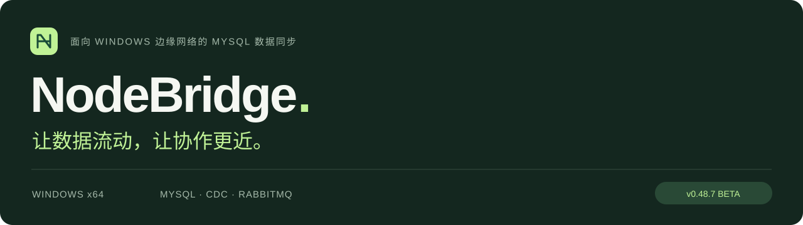

<p align="center">
  <a href="README.md">English</a> · <a href="README.zh-CN.md">简体中文</a> · <a href="README.ja.md">日本語</a>
</p>



<p align="center">
  <strong>连接中心服务器与边缘节点，让 MySQL 数据同步、本地管理和断线恢复 进入同一个工作流。</strong>
</p>

<p align="center">
  <a href="https://github.com/YufeiSun5/NodeBridge/releases/download/v0.48.7/NodeBridge-beta-v0.48.7-20260915.exe"><strong>⬇ 下载 Windows 安装包</strong></a>
  &nbsp; · &nbsp; <a href="https://github.com/YufeiSun5/NodeBridge/releases/tag/v0.48.7">发行说明</a>
  &nbsp; · &nbsp; <a href="docs/lan-deployment-guide.md">部署指南</a>
</p>

---

## MCP · 让 AI 助手接入同步运维

**通过本机 stdio 或远程 SSH，把自己的 MCP 客户端接入 NodeBridge。** 在对话中查证据、管理配置、跟踪对齐任务。

| 你可以这样问 | NodeBridge 提供的能力 |
| --- | --- |
| “这个节点为什么不再同步？” | 查看 Agent 状态、队列、日志和事件收据，导出诊断包。 |
| “保存前帮我核对这条映射。” | 读取表结构与规则、本机预检、校验配置，并通过版本检查保存修改。 |
| “跟踪我们已授权的首次对齐。” | 发起已确认的任务、轮询进度，核对整组完成后再恢复同步。 |

还支持 Agent 启停、失败事件重试，以及结构化业务数据查询和修改。数据修改需要计划与显式确认，不提供任意 Shell 或原始 SQL 执行。

**接入方法：**先保存完整配置，在 NodeBridge 开启 MCP，再用配置所属的 Windows 账户运行客户端。每个节点配置独立条目；远程通过 SSH 传输 stdio，无需开放 MCP HTTP 端口。

```powershell
& 'C:\Program Files\NodeBridge\app\SyncAgent.exe' mcp-stdio -config 'C:\ProgramData\NodeBridge\config.yaml'
```

首次对齐要求所有参与端停止 Agent、确认操作，并在轮询期间保持各端 MCP 会话；返回 `running` 不代表完成。规则预检仅检查本机，修改后还需核对已保存与已生效版本。

[MCP 工具与客户端配置](docs/mcp-service.md) · [多节点 AI 操作交接指南](docs/mcp-business-ai-handoff.md) · [交互式 MCP 介绍](https://yufeisun5.github.io/NodeBridge/#mcp)

## 为连接中的每一个环节而设计

<table>
<tr>
<td width="50%"><h3>↻ &nbsp; 断线自动接续</h3><p>重建失效的 RabbitMQ 连接，网络恢复后自动接续同步。</p></td>
<td width="50%"><h3>↔ &nbsp; 明确数据去向</h3><p>配置数据库、表与列的映射，支持双向同步。</p></td>
</tr>
<tr>
<td width="50%"><h3>≡ &nbsp; 规则更好读</h3><p>显示名称清晰醒目，保留稳定 ID 和已有对齐记录。</p></td>
<td width="50%"><h3>↑ &nbsp; 系统库随软件升级</h3><p>安装时更新已配置的 NodeBridge 系统库，迁移失败时阻止完成。</p></td>
</tr>
<tr>
<td width="50%"><h3>✓ &nbsp; 提交之后再确认</h3><p>通过事务、事件幂等和明确的消息确认边界处理同步。</p></td>
<td width="50%"><h3>⌘ &nbsp; 在自己的环境中管理</h3><p>使用本地 Wails 界面或 SSH stdio MCP 配置与诊断。</p></td>
</tr>
</table>

## 规则清晰，细节一目了然


<sub>NodeBridge 实际前端界面，使用隔离测试数据。突出规则名称，支持搜索导航与紧凑编辑。</sub>

## 开始使用

1. **准备环境。** 单独安装 MySQL，为每个节点设置唯一 ID，并备份配置、规则和数据库。
2. **安装软件。** 使用计划运行的 Windows 账户，以管理员身份启动 x64 安装包。内含 NodeBridge、SyncAgent、Erlang/OTP、RabbitMQ、Java、Canal 和 WinSW。
3. **配置并验证。** 设置数据映射，核对首次对齐，在自己的环境中验证新增、更新、删除与断线恢复。

> 升级提示：这些修复无需为业务表新增字段。修改显示名称时保留规则 ID 与对齐记录；已配置系统库迁移失败时，会阻止安装完成。

程序目录：`C:\Program Files\NodeBridge\app` · 数据目录：`C:\ProgramData\NodeBridge`。关闭窗口后驻留托盘；真正退出需要配置中的退出密码。

## 版本与验证

**v0.48.7 Beta** 修复自动重连、批处理已提交前缀漏转发与双向目标库选择。Go 全测/vet/lint、安装器检查及两轮隔离三 Agent 重连验证通过。这不代表三台物理电脑性能或生产 SLA。安装包未签名。

[查看完整验证报告](docs/v0.48.7-reconnect-handoff-20260915.md) · [SHA256](https://github.com/YufeiSun5/NodeBridge/releases/download/v0.48.7/SHA256SUMS.txt)

## 继续了解

- [内网部署手册](docs/lan-deployment-guide.md)
- [首次对齐](docs/initial-alignment.md)
- [路由策略](docs/sync-routing-policy.md)
- [受管组件边界](docs/managed-components.md)
- [现场试运行](docs/trial-runbook.md)
- [MCP 参考](docs/mcp-service.md)

<details>
<summary><strong>构建与验证</strong></summary>

```powershell
go test ./...
go vet ./...
golangci-lint run ./...
cd frontend
npm ci
npm test
npm run build
```

</details>

---

基于 [MIT 许可证](LICENSE) 开源。GitHub 默认展示英文 README，可从顶部切换语言。
